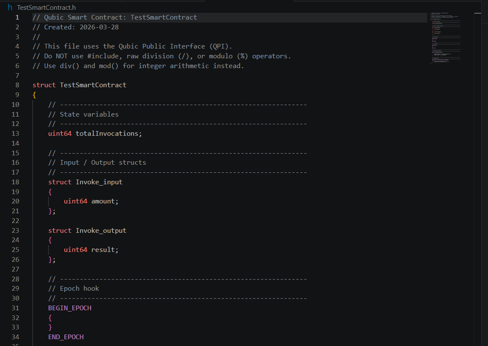

# Qubic QPI Language Support

VS Code extension providing language support for **Qubic Smart Contracts** written with the Qubic Public Interface (QPI).

---

## Features

### Syntax Highlighting
- QPI control macros highlighted as keywords (`PUBLIC_PROCEDURE`, `BEGIN_EPOCH`, etc.)
- QPI built-in types styled as storage types (`id`, `sint64`, `uint64`, `Array`, etc.)
- QPI API calls styled as support functions (`qpi.transfer`, `qpi.K12`, etc.)
- Raw `#include` directives flagged as invalid (except `#include "qpi.h"` / `<qpi.h>` for local IntelliSense)
- Raw `/` and `%` operators flagged as illegal (use `div` / `mod`)

### Snippets
| Prefix | Description |
|---|---|
| `qpi-contract` | Full contract skeleton with state, I/O structs, epoch/tick hooks, and registration |
| `qpi-procedure` | `PUBLIC_PROCEDURE` block |
| `qpi-function` | `PUBLIC_FUNCTION` block |
| `qpi-procedure-locals` | `PUBLIC_PROCEDURE_WITH_LOCALS` block |
| `qpi-function-locals` | `PUBLIC_FUNCTION_WITH_LOCALS` block |
| `qpi-epoch` | `BEGIN_EPOCH` / `END_EPOCH` block |
| `qpi-tick` | `BEGIN_TICK` / `END_TICK` block |

Snippets are available in both `qpi` and `cpp` language modes.

### Linter (Diagnostics)
The extension analyses `.h` files that inherit from `ContractBase` and applies the [QPI C++ restrictions](https://docs.qubic.org/developers/qpi/) (no stack locals except via `_WITH_LOCALS` macros, no raw pointers/`[]`, no `#` except optional `qpi.h` include for IDE use, no `float`/`double`, use `div`/`mod` instead of `/`/`%`, no string/char literals, no `...`, no `__`, limited `::`, no `union`, controlled `typedef`/`using`, QPI integer types only, etc.):

| Code | Severity | Rule |
|---|---|---|
| `QPI001` | Warning / Error | **Warning:** `#include "qpi.h"` / `<qpi.h>` only (IDE helper — remove before deploy). **Error:** any other `#` line (other includes, `#define`, etc.) |
| `QPI002` | Error | `/` operator prohibited — use `div(a, b)` |
| `QPI003` | Error | `%` operator prohibited — use `mod(a, b)` |
| `QPI004` | Error | String literals (double quotes) prohibited |
| `QPI005` | Error | Character literals (single quotes) prohibited |
| `QPI006` | Error | `[` and `]` prohibited |
| `QPI007` | Error | `...` (variadic / parameter packs) prohibited |
| `QPI008` | Warning | `::` only for types/namespaces in this contract or `QPI` from `qpi.h` |
| `QPI009` | Error | `*` except for multiplication (no pointers) |
| `QPI010` | Error | `BEGIN_EPOCH` without matching `END_EPOCH` |
| `QPI011` | Error | `BEGIN_TICK` without matching `END_TICK` |
| `QPI012` | Warning | `PUBLIC_PROCEDURE` / `PUBLIC_FUNCTION` not registered |
| `QPI013` | Error | `__` (double underscore) prohibited |
| `QPI014` | Error | `float`, `double`, `union`, `const_cast`, `QpiContext` prohibited |
| `QPI015` | Error | Native C/C++ `int` / `char` / `short` / `long` / `bool` / `signed` / `unsigned` — use QPI types |
| `QPI016` | Error | `typedef` / `using` only in local scope; `using namespace QPI` allowed at file scope |

The linter and validator run on file open, save, and every keystroke.

### Command: New Smart Contract
**Command palette:** `Qubic: New Smart Contract`

Prompts for a contract name, generates a `.h` file with a complete QPI skeleton, and opens it in the editor.

---

## Usage Guide

### 1. Install the Extension

Search for **"Qubic QPI Language Support"** in the VS Code Extensions panel (`Ctrl+Shift+X`) or install directly from the [Marketplace](https://marketplace.visualstudio.com/items?itemName=AndyQus.qubic-org-qpi).

### 2. Create a New Smart Contract

Open the Command Palette (`Ctrl+Shift+P`) and run:

```
Qubic: New Smart Contract
```

Enter a contract name (letters, digits, underscores). The extension creates a ready-to-use `.h` file with a complete QPI skeleton and opens it in the editor.

### 3. IntelliSense for `qpi.*`

While editing any `.h` file that contains QPI keywords, type `qpi.` to get an autocomplete list of all available API methods. Each entry shows the full signature, return type, and a description. Tab stops let you fill in arguments quickly.



### 4. Hover Documentation

Hover over any `qpi.*` call or QPI keyword (`PUBLIC_PROCEDURE`, `BEGIN_EPOCH`, etc.) to see inline documentation — signature, return type, and a usage description — without leaving the editor.

### 5. Code Snippets

Type one of the snippet prefixes and press `Tab`:

| Prefix | What it inserts |
|---|---|
| `qpi-contract` | Complete contract skeleton |
| `qpi-procedure` | `PUBLIC_PROCEDURE` block |
| `qpi-function` | `PUBLIC_FUNCTION` block |
| `qpi-procedure-locals` | `PUBLIC_PROCEDURE_WITH_LOCALS` block |
| `qpi-function-locals` | `PUBLIC_FUNCTION_WITH_LOCALS` block |
| `qpi-epoch` | `BEGIN_EPOCH` / `END_EPOCH` block |
| `qpi-tick` | `BEGIN_TICK` / `END_TICK` block |

Snippets work in both `qpi` and `cpp` language modes.

### 6. Linter Warnings and Errors

The linter activates automatically for `.h` files that contain QPI keywords. Problems appear in the **Problems** panel (`Ctrl+Shift+M`) and as coloured underlines in the editor:

| Code | Colour | What to do |
|---|---|---|
| `QPI001` | Yellow (**Warning**) for `#include` *qpi.h* only; red (**Error**) for any other `#` | Remove all `#` before deploy; `qpi.h` is warning-level as a dev-only include |
| `QPI002` | Red (Error) | Replace `/` with `div(a, b)` |
| `QPI003` | Red (Error) | Replace `%` with `mod(a, b)` |
| `QPI004`–`QPI009`, `QPI013`–`QPI016` | Red (Error) | Match the restriction named in the Problems panel message |
| `QPI008` | Yellow (Warning) | Use `::` only for contract types or `QPI::…` from `qpi.h` |
| `QPI010` | Red (Error) | Add missing `END_EPOCH` after `BEGIN_EPOCH` |
| `QPI011` | Red (Error) | Add missing `END_TICK` after `BEGIN_TICK` |
| `QPI012` | Yellow (Warning) | Register the procedure/function (see Section 7) |

### 7. Contract Validator

The **Contract Validator** checks the overall structure of a QPI contract and catches mistakes that the line-level linter cannot see.

**QPI010 — Missing `END_EPOCH`**

Every `BEGIN_EPOCH` block must be closed with `END_EPOCH`. If the closing macro is absent the contract will not compile inside the Qubic node.

```cpp
// Wrong — triggers QPI010
BEGIN_EPOCH
{
}
// END_EPOCH  ← missing

// Correct
BEGIN_EPOCH
{
}
END_EPOCH
```

**QPI011 — Missing `END_TICK`**

Same rule as QPI010, but for tick hooks.

```cpp
// Correct
BEGIN_TICK
{
}
END_TICK
```

**QPI012 — Unregistered procedure or function**

Every `PUBLIC_PROCEDURE` and `PUBLIC_FUNCTION` you declare must be listed inside the `REGISTER_USER_FUNCTIONS_AND_PROCEDURES` block. Omitting the registration means the Qubic network will never call your entry point.

```cpp
// Declaration (triggers QPI012 if not registered below)
PUBLIC_PROCEDURE(Transfer)
{
    // ...
}

// Registration block — Transfer must appear here
REGISTER_USER_FUNCTIONS_AND_PROCEDURES
{
    REGISTER_USER_PROCEDURE(Transfer, 1);   // ← required
}
```

The index (`1`, `2`, …) is the call index used by clients to invoke the entry point. Each entry point needs a unique index.

---

## QPI-Specific Rules

### Preprocessor (`#`)
All preprocessor directives are prohibited in deployed contracts. For local development you may add `#include "qpi.h"` or `#include <qpi.h>` so IntelliSense understands QPI types; remove every `#` line before the contract is deployed. Use QPI built-in types and the `qpi` API object exclusively.

### Integer Division and Modulo
The `/` and `%` operators are prohibited in QPI contracts (e.g. division by zero can yield inconsistent state). Always use:
- `div(dividend, divisor)` instead of `a / b` (returns zero if the divisor is zero)
- `mod(dividend, divisor)` instead of `a % b` (returns zero if the divisor is zero)

### `div()` and `mod()` are safe and valid
The linter flags raw `/` and `%` but does **not** flag `div()` or `mod()` — they are the required QPI idioms.

### Supported QPI API (`qpi.*`)
| Method | Description |
|---|---|
| `qpi.invocator()` | Identity of the direct caller |
| `qpi.originator()` | Identity of the transaction originator |
| `qpi.transfer(dest, amount)` | Transfer QU from contract to address |
| `qpi.burn(amount)` | Burn QU permanently |
| `qpi.K12(data)` | Qubic K12 hash function |
| `qpi.issueAsset(...)` | Issue a new asset |
| `qpi.transferShareOwnershipAndPossession(...)` | Transfer asset shares |
| `qpi.tick()` | Current tick number |
| `qpi.epoch()` | Current epoch number |
| `qpi.year() / month() / day()` | Current UTC date parts |
| `qpi.hour() / minute() / second()` | Current UTC time parts |

---

## Screenshot


---

## Requirements

- VS Code `^1.85.0`
- No runtime dependencies

## Building from Source

```bash
npm install
npm run compile
npm run package   # produces .vsix
```

Install the `.vsix` via *Extensions: Install from VSIX* in VS Code.

---

## Feature-Roadmap

### Phase 1 - MVP (this release)
- [x] Syntax Highlighting (QPI keywords, macros, types)
- [x] Code Snippets (PUBLIC_PROCEDURE, PUBLIC_FUNCTION, contract skeleton)
- [x] Linter: QPI language restrictions (`#`, `/`, `%`, pointers, native types, etc.)
- [x] "New Qubic SC" template command

### Phase 2 - Comfort
- [x] IntelliSense for all `qpi.*` functions
- [x] Hover documentation
- [x] Error squiggles (red underline for harder violations)

### Phase 3 - Power
- [ ] Dev Kit integration (deploy to testnet)

  > **Note for contributors:** This feature requires a stable Qubic CLI or REST API that allows contract developers to deploy `.h` files to the Qubic testnet directly from VS Code. As of 2026-03, no such public API exists for contract developers — [qubic-cli](https://github.com/qubic/qubic-cli) is targeted at node operators, not smart contract authors. If you know of an official deploy API or Dev Kit, please open an issue or contact the publisher.

- [x] Contract validator

## Marketplace

[Qubic QPI Language Support – VS Code Marketplace](https://marketplace.visualstudio.com/items?itemName=AndyQus.qubic-org-qpi)

---

## Sources
- [QPI Documentation](https://docs.qubic.org/developers/qpi/)
- [Unofficial SC Guide](https://medium.com/@qsilver97/an-unofficial-guide-to-writing-qubic-smart-contracts-sc-774541a88610)
- [vscode-solidity as reference](https://github.com/juanfranblanco/vscode-solidity)
